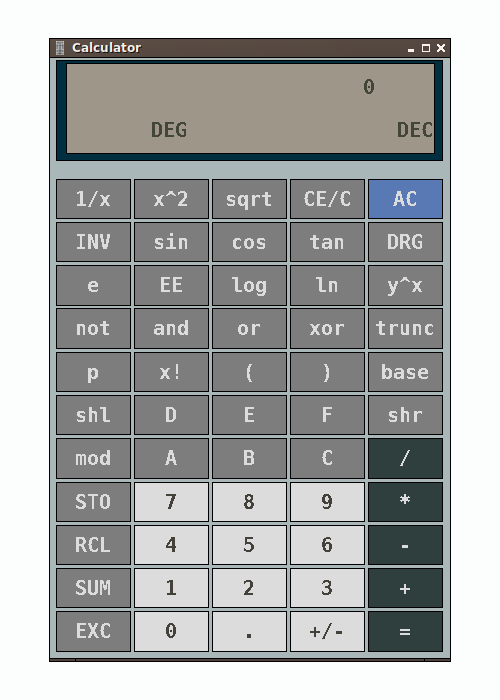

### calculator

Finally found the best calculator for linux.



### .Xdefaults
```
xcalc.ti.*.font: -misc-dejavu sans mono-bold-r-normal--20-*-100-100-m-0-iso8859-1
xcalc.ti.Command.width: 48
xcalc.ti.button2.label: x^2
xcalc.ti.button3.label: sqrt
xcalc.ti.button35.label: /
xcalc.geometry: 400x600

xcalc.ti.background: #CCCCCC
xcalc.ti.bevel.background: #333333
xcalc.ti.bevel.screen.*.background: #999999
xcalc.ti.bevel.screen.*.foreground: #333333
xcalc.ti.Command.foreground: #CCCCCC
xcalc.ti.Command.background: #666666
xcalc.ti.button4.background: firebrick4
xcalc.ti.button5.background: firebrick3

xcalc.ti.button35.background: #333333
xcalc.ti.button40.background: #333333
xcalc.ti.button45.background: #333333
xcalc.ti.button50.background: #333333
xcalc.ti.button55.background: #333333

xcalc.ti.button37.background: #CCCCCC
xcalc.ti.button38.background: #CCCCCC
xcalc.ti.button39.background: #CCCCCC
xcalc.ti.button42.background: #CCCCCC
xcalc.ti.button43.background: #CCCCCC
xcalc.ti.button44.background: #CCCCCC
xcalc.ti.button47.background: #CCCCCC
xcalc.ti.button48.background: #CCCCCC
xcalc.ti.button49.background: #CCCCCC
xcalc.ti.button52.background: #CCCCCC
xcalc.ti.button53.background: #CCCCCC
xcalc.ti.button54.background: #CCCCCC

xcalc.ti.button37.foreground: #333333
xcalc.ti.button38.foreground: #333333
xcalc.ti.button39.foreground: #333333
xcalc.ti.button42.foreground: #333333
xcalc.ti.button43.foreground: #333333
xcalc.ti.button44.foreground: #333333
xcalc.ti.button47.foreground: #333333
xcalc.ti.button48.foreground: #333333
xcalc.ti.button49.foreground: #333333
xcalc.ti.button52.foreground: #333333
xcalc.ti.button53.foreground: #333333
xcalc.ti.button54.foreground: #333333
```

### ~/.local/share/applications/xcalc.desktop
```
[Desktop Entry]
Name=XCalc
Exec=xcalc
Type=Application
Icon=/usr/share/icons/Papirus/24x24/apps/xcalc.svg
Terminal=false
```
